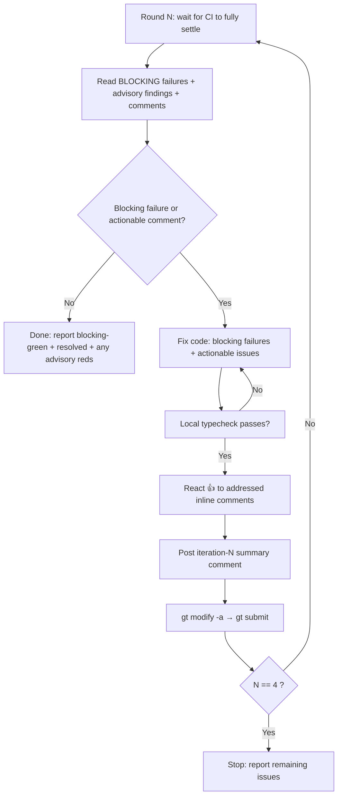

# PR Iteration Loop

Close the loop on a freshly-submitted PR: **wait → read → fix → verify → acknowledge → resubmit**, up to **4 rounds**. Each round drives the PR toward green CI and resolved review feedback without the user babysitting it.

## When to run (and when not to)

- **Run it** when the user invokes `/pr-iteration`, or asks to "wait for CI and fix the comments", "address review feedback", "handle the PR reviews", "fix failing checks on my PR".
- **Don't auto-start it.** Right after a `gt submit`, *recommend* it ("CI and the review bots will take a few minutes — want me to run `/pr-iteration` to wait and address feedback?") and let the user kick it off. It pushes commits and posts comments on a real PR, so the user decides when to enter the loop.

## Prerequisites

- The branch's PR is already submitted (`gt submit` done) so CI is running.
- `gh` authenticated, `gt` (Graphite) set up — this repo uses **`gt`, never raw `git`**, for commits/pushes.
- Scripts live next to this file in `scripts/`. Run them from the repo root.

## The loop



> **Blocking vs advisory.** Not every red check gates the merge. `wait-ci.sh` uses GitHub's per-PR `isRequired` signal to split failures into **blocking** (required — must go green) and **advisory** (non-blocking — e.g. `code-review`, `security-review`, `Agent Behavior Detection`; they *find* issues but don't gate). An advisory red does **not** keep the loop alive on its own — its findings come to you as PR comments, which you triage like any other comment. Only **blocking** failures and **actionable comments** drive another round.


### Step 1 — Wait for CI to fully settle

Review bots (code-review, security-review, compliance-review, database-review, …) only post their comments **after** they finish, so wait for **every** check to complete — not just partial progress. Force full settle by disabling the partial-progress exit:

```bash
PROGRESS_DROP=999 POLL_INTERVAL=30 .agents/skills/pr-iteration/scripts/wait-ci.sh
```

Each poll prints a `running/passed/failed` tally with failures split into **blocking** (✗, required) and **advisory** (⚠, non-blocking), each listed as `name · runId · jobId`. It exits 0 when `running=0`. **Record the blocking failures** (you must fix these) and **note the advisory ones** (their findings usually arrive as comments — verify in Step 2).

### Step 2 — Read what needs fixing

Two sources of work:

1. **Failing CI checks** — for each failed check from Step 1, pull the error. Prioritize **blocking** failures (they gate the merge); for **advisory** ones, the log tells you whether the finding is real and whether it also surfaced as a comment:
  ```bash
   gh run view <runId> --log-failed          # whole run's failed steps
   gh run view --job <jobId> --log-failed     # one job, tighter output
  ```
2. **Review comments** — conversation comments (last 10, includes the AI review bots) plus live inline comments:
  ```bash
   .agents/skills/pr-iteration/scripts/fetch-comments.sh
  ```
   It already filters inline comments to the ones that matter: **not outdated, not resolved, no reaction yet**. Each prints with `id="<databaseId>"` — keep these ids for Step 4.

### Step 3 — Decide

The loop is **done** when there are **no blocking failures and no actionable comments** — skip to the final report. Advisory reds alone do **not** justify another round; don't post a comment or push an empty commit just to "do a round". (Still list them in the final report so the user can judge them.)

Sort the work — not every signal is a code change:

- **Blocking CI failure** — a required check is red. → must fix to go green.
- **Actionable comment** — a concrete fix request, a real bug, a failing assertion (from a human or an advisory bot). → fix it.
- **Non-actionable** — a question, a nit you disagree with, out-of-scope, or an advisory finding you're intentionally not taking. → don't silently change code. Reply in-thread (`gh pr comment` won't thread; use the inline reply below) with your reasoning, then still react so it doesn't resurface.

### Step 4 — Fix

Make the actual code changes that resolve each failing check and each actionable comment. Real fixes — not just suppressing the symptom. If a CI failure looks like flake or infra (not your diff), say so explicitly in the summary rather than pretending you fixed it.

### Step 5 — Verify locally BEFORE pushing

Pushing a fix that doesn't compile burns a full CI cycle (~5–15 min) and a whole iteration of your 4-round budget. Always typecheck first — turbo caches, so it's fast:

```bash
pnpm typecheck      # turbo run typecheck across the workspace
pnpm lint           # if your change could trip lint
```

Only proceed once typecheck is clean. If you changed tests, run the affected package's tests too.

### Step 6 — Acknowledge the inline comments you addressed

A reaction marks a comment as handled — and `fetch-comments.sh` skips reacted comments next round, so this is what prevents the same feedback looping forever. Pass the `id`s from Step 2:

```bash
.agents/skills/pr-iteration/scripts/ack-comment.sh <id1> <id2> <id3>
```

For a **non-actionable** comment you're declining, reply in its thread first, then react:

```bash
gh api --method POST repos/{owner}/{repo}/pulls/{pr}/comments/{id}/replies -f body="<reasoning>"
```

### Step 7 — Post the iteration summary

One conversation comment per round, with `N` = the current round number. Be specific and honest — list what actually changed:

```bash
gh pr comment <pr> --body "Addressed review feedback (iteration N):

- Fixed: <description of what was fixed>
- Updated: <tests/types/etc that were updated>

Changes pushed."
```

### Step 8 — Commit and resubmit

Amend the existing commit and push via Graphite (re-running CI for the next round):

```bash
gt modify -a
gt submit --no-interactive
```

Then loop back to **Step 1** for round N+1.

## Stop conditions

Stop and write the final report when **any** holds:

- All **blocking** checks are green and no actionable comments remain (success — advisory reds may still be present and that's fine).
- You've completed **4 rounds** (hard cap — don't exceed it).
- You're stuck: same blocking failure persists across rounds, or a fix needs a decision only the user can make. Stop early and surface it.

## Final report

End with a short status: which round you stopped on, **blocking** CI state (green / which required checks are still red), **advisory** reds you left (name them, with one line on why each is safe to ignore or needs a human call), what you fixed, what you reacted to / replied to, and anything left for the user (flaky CI, design questions, out-of-scope requests). Don't claim green if a required check is red — paste its name.

## Guardrails

- **`gt`, never raw `git`** for commits/pushes — raw git corrupts Graphite stack state.
- React/comment/push **only after** the fix is made and typecheck passes — never acknowledge feedback you haven't actually addressed.
- The summary comment's `N` increments each round; don't reset it.
- Respect the 4-round cap even if issues remain — report them instead of looping forever.

